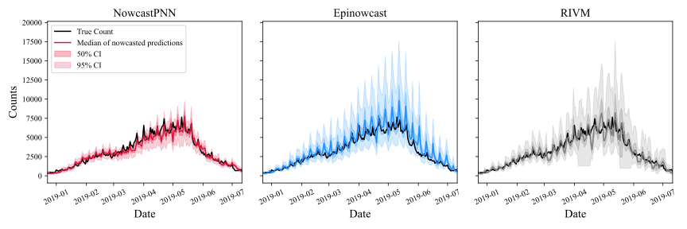
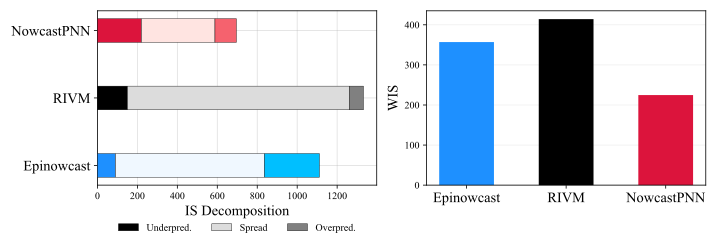

# NowcastPNN

This repository contains all code required for reproducing the results corresponding to the thesis paper titled "Attention-Based Probabilistic Neural Networks for Nowcasting of Dengue Fever in Brazil". The paper proposes a novel neural network (NN) structure, based on the popular attention mechanism and outputs a distribution over the target variable instead of a single point prediction (hence the name probabilistic). Valid uncertainty intervals are obtained from sampling from the generated distribution and the use of Monte Carlo (MC) Dropout. All data necessary is available upon request. Any contributions to this repository and the NowcastPNN model are welcome. Users can easily apply the model to their own data and recreate the plots seen here. Although all hyperparameters of the models can be tuned, the models can be safely employed out of the box and pre-configured models and notebooks are available for straightforward usage and demonstration. A diagram showing the structure is [Architecture_slide.pdf](./outputs/figures/Architecture_slide.pdf).

The plot below illustrates the strenghts of the NowcastPNN. For same day nowcasts on unseen data, the estimates from the NowcastPNN are much closer to the true values, while having narrower (more precise) confidence intervals.

To compare the benchmark models (Epinowcast and RIVM) to the NowcastPNN the Interval Score (IS) and Weighted IS (WIS) can be used, as seen below, where the NowcastPNN has significantl lower values and less spread than the other models.

## Table of Contents

- [Data](#data)
- [Outputs](#outputs)
- [Installation](#installation)
- [Usage](#usage)
- [Reproducibility](#reproducibility)
- [Contributing](#contributing)
- [License](#license)

## Data

The dataset used in this project is sourced from the Brazilian Ministry of Health (Ministério da saúde) and its associated DATASUS service. For this analysis, data on Dengue incidences in São Paulo from years 2013 to 2020 were used.

## Outputs

The outputs folder contains the results of the analyses. The subdirectory [figures](./outputs/figures/) contains all images used in the thesis.

## Installation

To run this project locally, follow these steps:

1. Clone the repository: git clone https://github.com/silaskoemen/NowcastPNN.git
2. Navigate to the project directory: cd NowcastPNN
3. Install required packages (preferably in a virtual environment to avoid conflicts): pip install -r requirements.txt OR pip3 install -r requirements.txt

## Usage

The folder [model_predictions](./data/model_predictions/) has dictionaries with prediction intervals (PIs) for all models in for both evaluation on most recent observations and randomly split test set. The directory [src](./src/) contains all source code to run the models and analyses with notebooks available for detailed analysis corresponding to different sections of the paper. Most importantly, [NowcastPNN.py](./src/NowcastPNN.py) contains the code for the NowcastPNN models, both with and without embedding of weekdays.
The folder [weights](./src/weights/) contains the trained model weights for a variety of situations, including trained on randomly split versus sequentially split data, as well as weights for analysis investigating the number of training data points or past units needed. The suffix `-rec` here stands for trained on older data to be evaluated on the most recent observations and suffix `-dow` stands for a model using the embedding block for the weekday.
Files [Epinowcast.R](./src/Epinowcast.R) and [RIVM.R](./src/RIVM.R) contain the code to form predictions from the benchmark models.
The model can thus be used directly by loading the desired weights. If you want to retrain the models, e.g. with different hyperparameter settings, just follow the outline of the jupyter notebooks. All plots created will be saved to the outputs folder directly.

## Reproducibility

Regarding the computational setup, special attention was given to ensure reproducibility, with seeds being used in every step of random sampling for all libraries used in the code. All code was run on macOS Sonoma 14.5 on a MacBook Air with M1 Chip and hardware acceleration activated via Apple Metal. Versions of all libraries used can be found in the [requirements.txt](requirements.txt) file. Because different operating systems and processing units (e.g. Windows/Mac or CPU/GPU) perform certain operations like matrix sums or multiplications in different orders, results might differ on other operating systems. Within each operating system and CPU/GPU choice, all results, including training runs and sampling from the final models, are reproducible and identical for every rerun. Moreover, weights of the trained models and final predictions (PIs, median, and minimum and maximum values) for both test sets are available in the folder [model_predictions](./data/model_predictions/).

## Contributing

Contributions are welcome. Please feel free to submit a pull request or open an issue if you encounter problems.

## License

This project is licensed under the [CC-BY-4.0](LICENSE) License.
      
